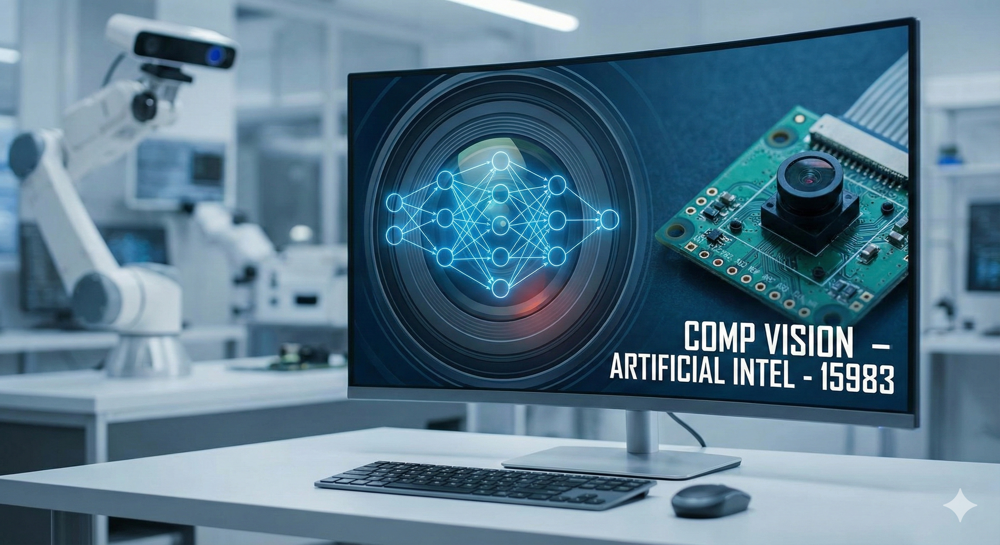

# Comp Vision-Artificial Intel-15983 (Comp_Vision) 


This folder contains computer vision projects and supporting artifacts from the AI Portfolio of Iman Haamid. It includes example notebooks, code, and documentation for small experiments, demos, and learning notes.
- code/ — directory intended for project code (currently present).
- docs/ — directory intended for written documentation, reports, and notes (currently present).
- FocusLens_Final_Project/ - Final Project named FocusLens

If you expect other notebooks, models, or assets, check the `code/` and `docs/` subfolders for additional files.

## Project structure
- Comp_Vision-ITAI1378/
  - README.md — this file
  - Comp Vision-Artificial Intel-15983 — (existing file)
  - FocusLens_Final_Project/ - Final Project named FocusLens
  - code/ — Python scripts, notebooks, training & evaluation code
    - notebooks/ — Jupyter notebooks demonstrating experiments
    - src/ — reusable modules and utilities
    - models/ — saved model checkpoints
  - docs/ — writeups, diagrams, design notes, reports

## Setup & requirements
A typical environment to run the examples in this folder:

- Python 3.8+
- pip or conda
- Common packages:
  - numpy
  - pandas
  - opencv-python
  - matplotlib
  - scikit-learn
  - torch (or tensorflow, depending on projects)
  - torchvision
  - jupyterlab / notebook
  - tqdm

Example (venv + pip):
```bash
python -m venv .venv
source .venv/bin/activate
pip install -r requirements.txt
# or install common packages:
pip install numpy opencv-python matplotlib scikit-learn torch torchvision jupyterlab tqdm
```

If you prefer conda:
```bash
conda create -n compvision python=3.9
conda activate compvision
pip install -r requirements.txt
```

## Contributing
- If you'd like to contribute, add a new folder under `code/` for your experiment, include instructions and dependencies, and open a pull request.

## Contact
- Author: Iman Haamid — GitHub: @imid12

---
